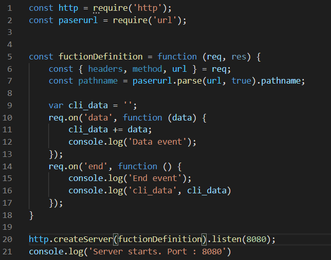
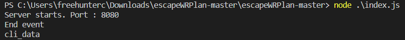

## Get, Post 
Day4에서 해본 Get방식(method)는 URL에 파라미터가 있어서 노출이 쉽습니다. 만약 그것이 비번이였더라면, 보안에 엄청난 허점이 생깁니다. 그런 단점으로 인해서 URL에 파라미터를 넣지 않고 다른 방식으로 정보를 전달 할 수 있는데 그 방법이 Post 입니다. (사실 이것 또한 해킹으로 부터 안전하시 않습니다. 이후에 간단히 배울것 입니다.)

하지만 이를 위해서 node의 큰 특징 중 하나인 event driven 이 무엇인지 조금은 알아야합니다. event driven을 간략히 설명하자면 특정 이벤트가 일어나면 정의 해준 코드를 실행시키게 합니다. node는 event driven 방식으로 구동합니다.  
우선 createServer는 파라미터로 함수를 받게 되어있고 그 함수는 client가 접속(event)시에 실행 하도록 되어있습니다. listen은 서버를 실행시켜라는 말입니다.  그리하여 23번 줄의 log가 먼저 출력 되고 client 접속 event가 발생하였을때 fuctionDefinition의 함수가 실행 됩니다. 

이와 같은 방식으로 좀 더 살피어 본다면 [req](https://nodejs.org/api/http.html#http_agent_requests)( node Doc에 자세히 설명 안되어있네..)라는 인자를 살피어 볼수있습니다. 
여기는 이미 이벤트가 정의 되어져 있는데 Client에서 post방식으로 데이터가 들어왔을때 실행시키는 event와 Client의 network 전송이 끝났을때(크롬 개발자 모드에서 확인 가능) 발생하는 event가 있습니다. 

그리하여 직접 테스트 해봤습니다.

위와 같이 get 방식으로 테스트 하게 된다면 data event를 타지 않고 바로 끝나는것을 확인할수있습니다.

위와 같이 post 방식으로 들어 왔을땐  data 이벤트를 타는것을 확인 할수 있습니다. 

----
To Do 
1. 이제 login창을 완성하여 ID 와 PW를 입력 받고 login을 누른다면 (post)  user 정보가 있다면 성공의 페이지를 띄우고 실패하였다면 실패라는 페이지를 띄워보세요.
Day05/to_do.js 파일을 참조 하세요.(기존에 만드신 기능들은 다 유지하시면서.. 해주세요)

