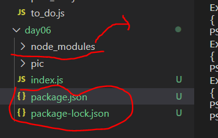
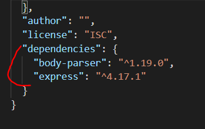
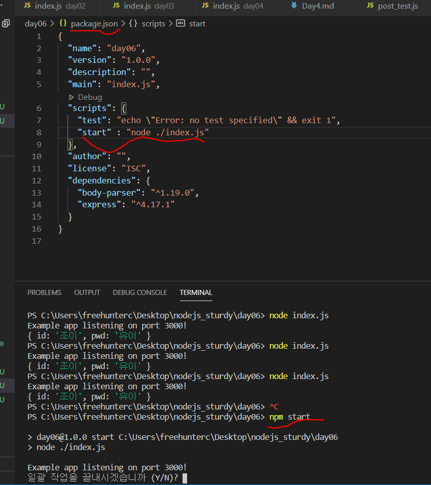

## Express Js

Node에는 여러가지 패키지가 있는데 그 중 http 기본 패키지 대신 서버를 만드는 가장 유명한 패키지가 Express 입니다. 앞서 다뤄본 http에 비해 웹서버에 필요한 기능들을 좀 더 쉽게 다뤄 볼 수 있습니다. (* Koa라는 패키지도 express 대용으로 많이 사용 됩니다.) 

우선 Express 라는 패키지를 설지 하기 위해서 우리는 npm(nodejs package manager) 을 사용할 것입니다. 이를 통해서 패키지를 쉽게 설치할 수 있고 나중에 자신이 만든 패키지 또한 관리 할 수 있습니다.

우선 새로운 폴더를 하나 만들어 줍니다. (ex : day6)  그리고 cmd 창에서 폴더 내 경로로 들어가 줍니다.  
그리고 npm init이라는 명렁어를 쳐서 하나의 패키지를 생성시켜 줍니다.  프로젝트 이름을 원하시는데로 적어 줍니다.(ex : day06)나머지는 그냥 엔터 쳐서 넘기시면 됩니다. 그렇다면 아래 사진과 같이 package.js 라는 것이 보일 것 입니다. 이는 패키지를 관리하기 위한 파일입니다. (나중에 패키지를 만들어 패포하기 유리합니다.)

그 다음 아래의 명령어르 쳐서 express를 설치해줍니다. (--save는 폴더 내 경로에만 설치를 하겠다는 것입니다.)
npm install express --save

아래를 보시면 package-lock.js파일 ( dependencies 대한 자세한 내용을 관리함) 그리고 모듈이 실제로 설치되는 node-modules 폴더가 새롭게 생성되고 package.js 파일에 express가 dependencies로 새롭게 추가 됨을 확인 할 수 있습니다. 

이제 express를 사용하기 위해 기본 적인 세팅이 끝났으므로 express 기본 예제를 아래와 같이 작성해봅니다. 

~~~
var express = require('express');
var app = express();

app.get('/', function (req, res) {
  res.send('Hello World!');
}); // path가 '/' 인경우 
app.listen(3000, function () {
  console.log('Example app listening on port 3000!');
});

~~~
보시면 아시겠지만 get 메서드를 사용하는 방식이 더욱 간결해지고 가독성이 올라감을 느낄수 있을 것입니다. 

이제 아래는 post 방식입니다.
그런데 get 방식과는 달리 중간에 body-parser라는 패키지가 사용하는것을 볼수 있습니다. Day05에서 아래와 같은 역활을 해주는 미들웨어라고 보시면 됩니다.  (받은 데이터를 req에 합쳐서 서버에게 보내주는 미들웨어)
~~~
req.on('data', function (data) {
cli_data += data; // 데이터가 짤려서 들어 올수 있습니다.
});
~~~

물론 "body-parser"패키지는 npm install body-parser --save를 해서 설치해줘야합니다.
~~~
const  express = require("express");
const  bodyParser = require("body-parser");
const  app = express();

app.use(bodyParser.urlencoded({ extended:  false }));
app.use(bodyParser.json());

app.post('/',function (req,res) {
console.log(req.body)
res.end(' ' + req.body.id);
});

app.listen(3000, function () {
console.log('Example app listening on port 3000!');

});
~~~
더하여 이제 실행 할때도 npm에 예약어를 만들어 놓고 실행을 하겠습니다(당장에는 왜해야 하지라고 생각 할 수 도 있지만 나중에 자연스럽게 알게 됩니다).  아래에 그림의 밑줄과 같이 package 파일에 추가 해주시고 , cmd 창에서 npm start라고 적어주세요 그럼 서버가 실행됩니다.

---- 
Todo 
1. Day05에서 하셧던것을 로그인에 관련된 화면은 Express를 이용한 post 방식으로 그리고 이름과 title에 관련된 화면은 Express를 이용한 get방식으로 만들어 주세요.

