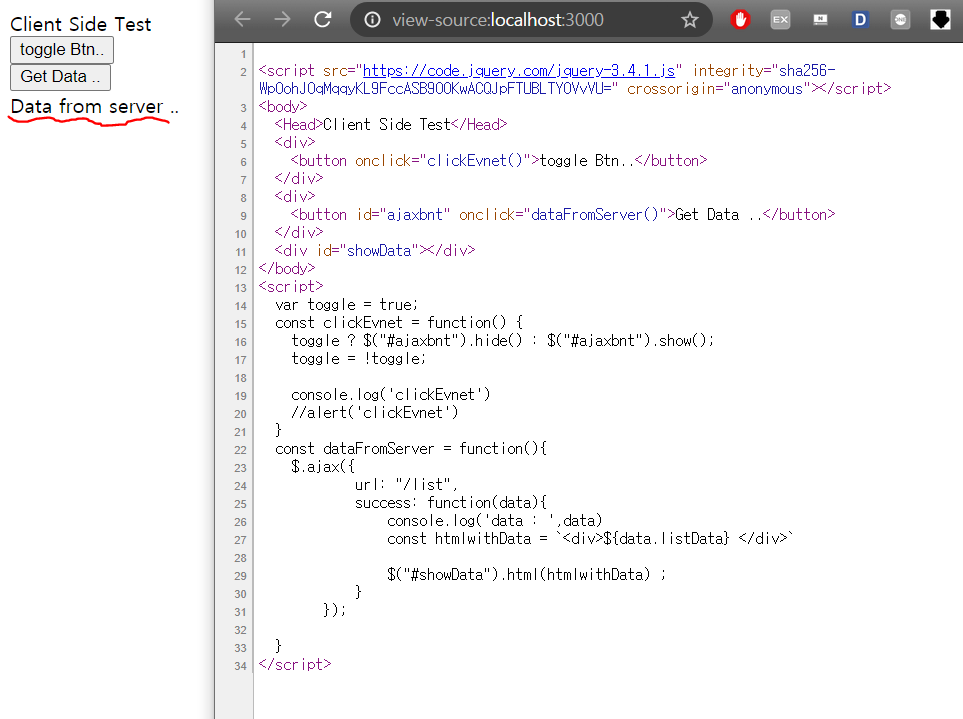
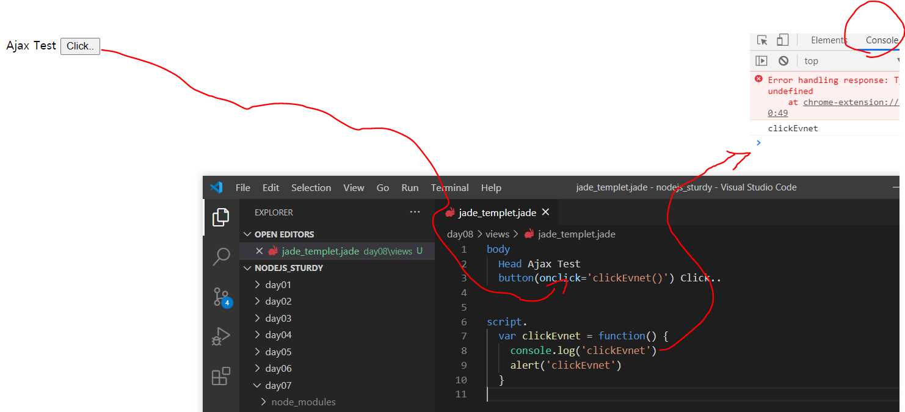

##  Client Side Render 맛보기(ajax)
지금까지 만들었던 페이지들을 회상해 본다면 server에서 html에서 모든 데이터를 전부 형성을 해서 client에게 보냈습니다. 
하지만 아래 그림을 확인 보시면 client 가 받은 곳 어디에도 ```Data from server ..``` 라는 것을 찾아 볼수 없습니다. 

이말은 곧 서버에서 html문서를 받은 후에 경우에 따라 더 데이터를 요청하고 이를 받아서 client는 그 부분을 다시 한번 render했다는것을 생각해볼수 있습니다. 


이렇게 경우에 따라 데이터를 더 받고 render 시켜주는 행위를 좀 더 편리하게 하는것이 Ajax라고 생각하시면 됩니다. 
그렇기에 Day7에 todo 3번에서 한 행위를 새로고침 없이 해결 할 수 있습니다. (Ajax가 client side 다라고 하면 틀린 말이지만 여기서는 그런역활을 한것입니다.)

하지만 이렇게 client side render 를 많이 해주게 된다면 검색엔진들이 주기적으로 하는 크롤링에서는 안 좋은 경우가 생깁니다. 그래서 만든 페이지가 노출에 유리하고 싶다면 항상 고려하면서 사용하는것이 중요합니다. 

Ajax를 사용하기 위해서는 첫줄에  아래를 내용을 추가 해주어야합니다.   
[Ajax Doc](https://api.jquery.com/category/ajax/)
```
script(src='https://code.jquery.com/jquery-3.4.1.js', integrity='sha256-WpOohJOqMqqyKL9FccASB9O0KwACQJpFTUBLTYOVvVU=', crossorigin='anonymous')
``` 

** 참고로 아래 화면을 보시면 javascript를 이용하여 브라우져 콘솔을 찍어서 이렇게 이벤트를 확인해 볼 수 있습니다.(버튼 이벤트가 어떠한 방식으로 구동하는지 확인 하세요.)


 

--- 
Todo 
1. Day08의 내용을 참고하여 이름, 나이, 성별, 주소를 보여주는 테이블로 만들고 이를 추가 , 삭제 하는 기능을 단 하나의 페이지에서 만드시오. 
- 추가 버튼을 누르면 이름, 나이, 성별, 주소 각각 입력 받을 수 있는 text field 를 만들고 저장, 취소 버튼이 있습니다. 저장, 취소 버튼을 누르면 입력 필드는 사라져야합니다. 
- 입력 혹은 삭제 버튼을 누른다면 새로고침 없이 테이블에서 살아져야합니다. 


